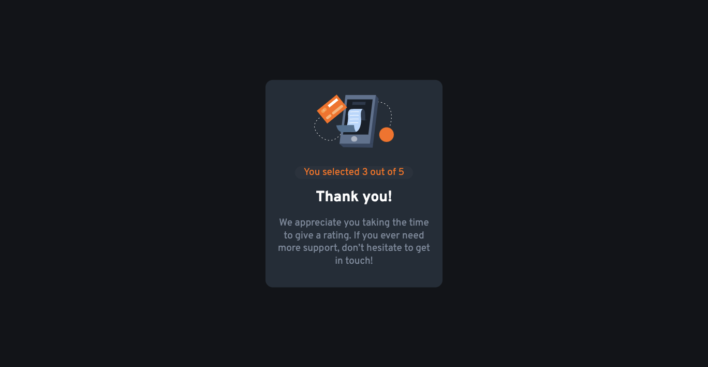

# Frontend Mentor - Interactive rating component solution

This is a solution to the [Interactive rating component challenge on Frontend Mentor](https://www.frontendmentor.io/challenges/interactive-rating-component-koxpeBUmI). Frontend Mentor challenges help you improve your coding skills by building realistic projects.

## Table of contents

- [Overview](#overview)
  - [The challenge](#the-challenge)
  - [Screenshot](#screenshot)
  - [Links](#links)
- [My process](#my-process)
  - [Built with](#built-with)
  - [What I learned](#what-i-learned)
  - [Continued development](#continued-development)
  - [Useful resources](#useful-resources)
- [Author](#author)
- [Acknowledgments](#acknowledgments)

## Overview

### The challenge

Users should be able to:

- View the optimal layout for the app depending on their device's screen size
- See hover states for all interactive elements on the page
- Select and submit a number rating
- See the "Thank you" card state after submitting a rating

### Screenshot




### Links

- Solution URL: [Frontend Mentor Site](https://www.frontendmentor.io/solutions/interactive-rating-component-SJQhT-oNc)
- Live Site URL: [Github Page](https://adrianna-thomas.github.io/interactive-rating-component/)

## My process

### Built with

- Semantic HTML5 markup
- CSS custom properties
- Flexbox
- CSS Grid
- Mobile-first workflow

### What I learned

I learned how to link my Javascript to my HTML.

```html
<script src="./script.js" defer></script>
```

I learned how to hide the result card.

```html
<div id="feedbackCard" class="card card-2 hidden"></div>
```

```css
.hidden {
  display: none;
}
```

---

I learned how to apply a background effect to an image.

```html

```

```css
.star {
  background-color: var(--Medium-Grey-bg);
  border-radius: 50%;
  padding: 0.85rem;
  max-width: 100%;
  display: block;
}
```

---

I learned how to make a function that changes the class of the selected button to display a different css style. And gets the value for the placeholder in the html code for the result of the selected rating.

```html
<p class="rating-result">You selected <span id="numberRating"></span> out of 5</p>
```

```js
function clickRatingBtn({ target }) {
  removeAllActiveClass();
  target.classList.add("active");
  selectedRating = target.value;
}
```

```css
.rating-btn.active {
  background-color: var(--Light-Grey);
  color: white;
}
```

---

I learned how to create a function that displays an alert if no rating is selected. It also changes what component is dispayed by adding and removing classes to the html.

```js
function ratingSubmit() {
  if (!selectedRating) {
    return alert("Please select number rating!");
  }

  numberRating.textContent = selectedRating;
  feedbackCard.classList.remove("hidden");
  ratingCard.classList.add("hidden");
}
```

### Continued development

Getting more comfortable using Javascript.

### Useful resources

- [Pixels to Rem Converter](https://www.ninjaunits.com/converters/pixels/pixels-rem/) - This helped me with deciding which rem values to apply to my stylesheet.

## Author

- Frontend Mentor - [@adrianna-thomas](https://www.frontendmentor.io/profile/adrianna-thomas)

## Acknowledgments

1. Rhode N'Komba: [LinkedIn](https://www.linkedin.com/in/rhode-n-komba-3b028a233/) - Helped me with troubleshooting why my Javascript wasn't connecting to my HTML.

2. IndraAk [Github](https://github.com/indraAK/Interactive-rating-component) - Helped me understand how to approach the Javascript portion of the project.
